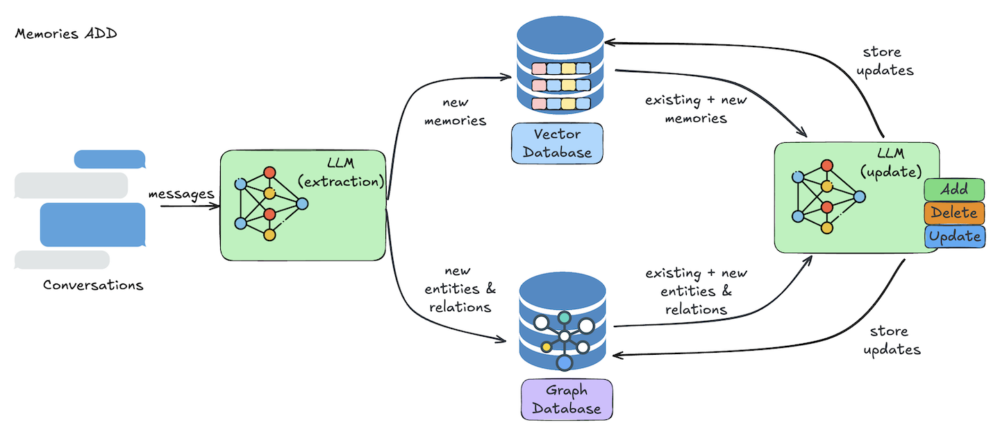
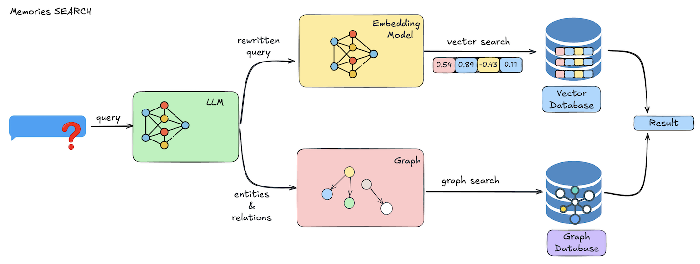

# Mem0

Mem0 (pronounced “mem-zero”) transforms AI assistants with a robust, adaptive memory system. By continuously learning from user interactions, Mem0 enables AI to provide tailored, context-rich responses that evolve over time.

Mem0 integrates large language models (LLMs) with vector-based storage for a powerful memory architecture. LLMs capture and process essential conversation details, while vector storage ensures rapid, semantic memory retrieval. This design bridges past and present interactions, delivering smarter, more responsive AI experiences.

📢 **Research Breakthrough**: Mem0 achieves 26% higher accuracy than OpenAI Memory, 91% lower latency, and 90% token savings! [Read the paper](https://docs.mem0.ai/research).

---

## 🚀 Mem0 SDK

A powerful toolkit for building AI systems with advanced memory capabilities — fast, scalable, and easy to integrate.

| Component        | Meaning                                                                 |
|-----------------|-------------------------------------------------------------------------|
| 🧠 LLM Memory    | Extracts and processes key info from conversations                      |
| 🔍 Semantic Search | Retrieves relevant memories using vector-based search                  |
| 🗄️ Dual Storage  | Vector database for memories, graph database for relationships          |
| 🛠️ Memory Ops    | Add and search memories with simple API endpoints                       |

Mem0 handles memory extraction, conflict resolution, and efficient retrieval, so you focus on building smarter AI.

---

## Core Concepts

Mem0 empowers AI with two key operations: **adding** and **searching** memories. These enable contextual, personalized interactions by storing and retrieving data efficiently.

### 🛠️ Memory Operations

#### Adding Memories
Ingests conversations and stores them as memories using a streamlined process:

- **Information Extraction**: LLM identifies key entities and relationships from conversations.
- **Conflict Resolution**: Compares new data with existing memories, resolving contradictions.
- **Memory Storage**: Stores memories in a vector database and tracks relationships in a graph database.



**Use case**: Persist user preferences or conversation context for personalized AI interactions.

#### Searching Memories
Retrieves relevant memories based on queries with a multi-step semantic search:

- **Query Processing**: LLM optimizes the search query and applies targeted filters.
- **Vector Search**: Performs semantic search, ranking results by relevance.
- **Result Processing**: Returns memories with relevance scores, metadata, and timestamps.



**Use case**: Fetch past interactions to deliver context-aware, personalized responses.

---

## What’s Inside?

| File                           | Core Concept            | What it Shows                                                    |
|--------------------------------|-------------------------|------------------------------------------------------------------|
| `vector_memory.ipynb`          | 🗂️ Vector Memory        | Store and retrieve memories using vector-based semantic search   |
| `graph_memory.ipynb`           | 🗄️ Graph Memory         | Manage relationships between memories with a graph database      |
| `custom_fact_extraction_prompt.ipynb` | 🧠 Fact Extraction | Customize LLM prompts for extracting key facts from conversations |
| `custom_update_memory_prompt.ipynb` | 🛠️ Memory Updates   | Customize prompts for updating and resolving memory conflicts     |

---

## 🚀 Run a Notebook

From the root of the repo:

```bash
jupyter notebook vector_memory.ipynb
```

Or just run individual cells in your Jupyter environment.

> ⚠️ Ensure dependencies are installed from the main repo first.

## 🤔 Want to go deeper?

Curious how it all works under the hood?
> 🔍 Dive deeper with the [full official docs here](https://docs.mem0.ai/overview).
